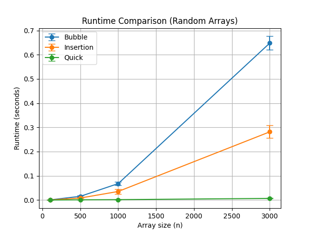
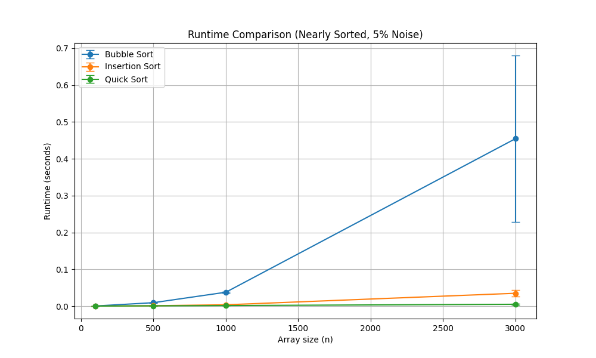
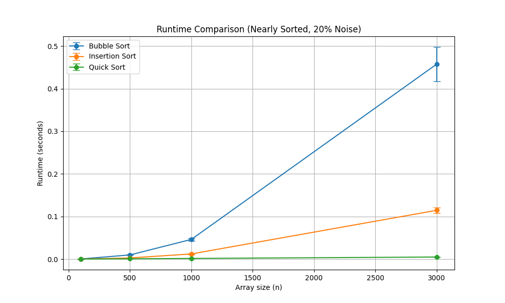

# Sorting Assignment

## Student Name

Tomer Zachor

---

## Selected Algorithms

* Bubble Sort
* Insertion Sort
* Quick Sort

---

## Note on Large Input Sizes

Some of the selected algorithms, such as Bubble Sort and Insertion Sort, have O(n²) time complexity.

Because of this, running them on very large input sizes (such as 1,000,000 elements) is not practical, since the runtime becomes extremely long.

Therefore, in this assignment, the experiments were limited to smaller input sizes that allow all algorithms to complete in reasonable time, while still clearly demonstrating the differences in growth rate between them.

---

## Result 1 – Random Arrays



In this experiment, we compared the running times of the three sorting algorithms on random arrays of increasing sizes.

Bubble Sort showed the worst performance, growing rapidly as the input size increased. Insertion Sort performed better than Bubble Sort, but still exhibited quadratic growth. Quick Sort was significantly faster and scaled much better with input size.

---

## Result 2 – Nearly Sorted Arrays (5% Noise)



In this experiment, we tested the algorithms on nearly sorted arrays with 5% noise.

Insertion Sort performed significantly better compared to the random case, as it is very efficient when the data is already close to sorted. Bubble Sort also improved slightly, but remained relatively slow. Quick Sort performance remained fast and stable.

The relatively large standard deviation for Bubble Sort at larger input sizes indicates variability in runtime measurements, which is expected due to its quadratic complexity.

---

## Result 3 – Nearly Sorted Arrays (20% Noise)



In this experiment, we tested the algorithms on nearly sorted arrays with 20% noise.

Compared to the 5% noise case, Insertion Sort became slower because the array was less ordered. However, it still performed better than in the fully random case. Bubble Sort remained inefficient, while Quick Sort continued to show fast and stable performance.

---

## How to Run the Program

Example command:

```bash
python run_experiments.py -a 1 3 5 -s 100 500 1000 3000 -e 0 -r 5
```
### Parameters:

* `-a` : Algorithms (1 = Bubble, 3 = Insertion, 5 = Quick)
* `-s` : Array sizes
* `-e` : Experiment type

  * 0 – Run all experiments
  * 1 – Random arrays
  * 2 – Nearly sorted (5% noise)
  * 3 – Nearly sorted (20% noise)
* `-r` : Number of repetitions

---

## Summary

This assignment demonstrates the differences in performance between sorting algorithms with different time complexities.

* Bubble Sort shows poor scalability due to O(n²) complexity
* Insertion Sort performs well on nearly sorted data
* Quick Sort consistently provides fast and stable performance

The experiments clearly illustrate how input characteristics affect algorithm efficiency.
